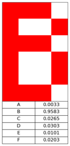
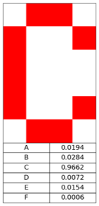
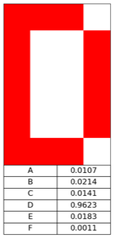
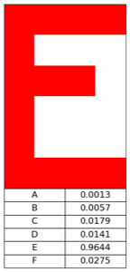
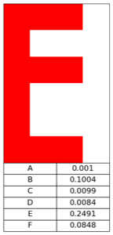
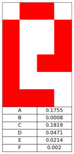

# Simple ANN - Letter Recognizer

Based on that great article: https://dev.to/shamdasani/build-a-flexible-neural-network-with-backpropagation-in-python

Network can recognize 6 chars from training set and similar

Charts are great so there is learning rate impact chart

## Results

Results after 1000 epoches with 0.5 learning rate

